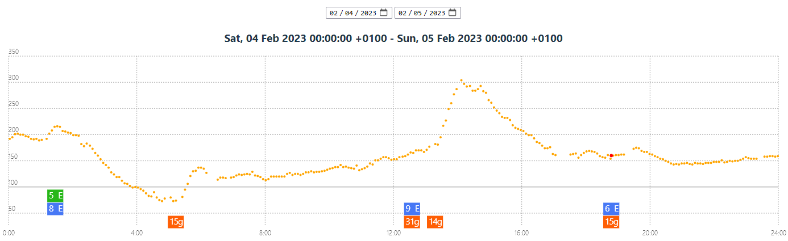

I needed a way to print historic data from [xdrip+](https://xdrip.readthedocs.io/en/latest/) but the existing options were lacking.

# Requirements

- [node.js](https://nodejs.org/)
- `Gnu Make` if you want to use the Makefile.

# Usage

- Clone this repository
- Export the xdrip+ database from your app, name it `export.sqlite` and place it in the project root directory. The running server has an upload option, too.
- `make init` initially or after changing code to build the app
- `make up` to run the server
- Available routes and database upload: <https://localhost:3000>
- Visualization app: <https://localhost:3000/app>

After choosing a time period with data you should see something like:

